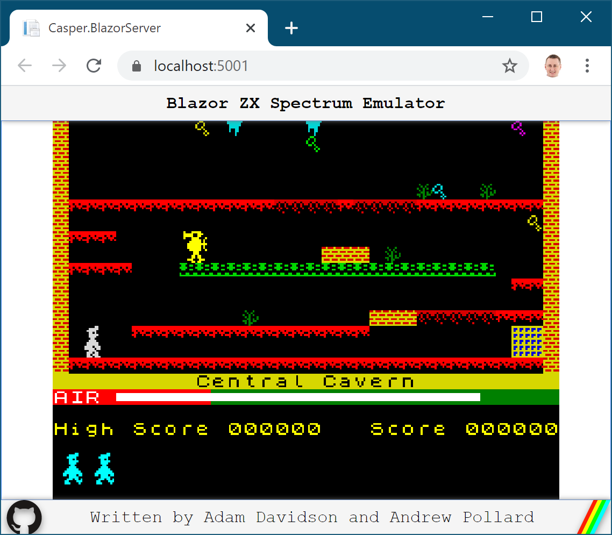
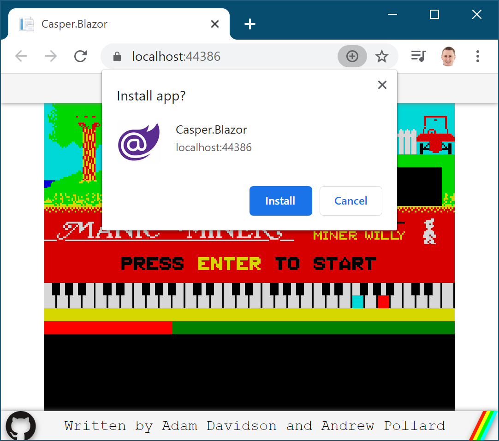
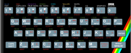

# Casper
**C# ZX Spectrum Emulator**

This project is a C# port of [Jasper](https://github.com/Arlorean/Jasper) (Java Spectrum Emulator)
for .NET Standard (2.0.3), Windows Forms (on .NET Framework 4.6.1),
and now [Blazor Server-side](https://docs.microsoft.com/en-gb/aspnet/core/blazor/hosting-models#blazor-webassembly)
 and [Blazor Client-side](https://docs.microsoft.com/en-gb/aspnet/core/blazor/hosting-models#blazor-server) (using WebAssembly)
on [.NET Core 3.1](https://devblogs.microsoft.com/dotnet/announcing-net-core-3-1/).

## How to Build

Download or fork this repository and open the `Casper.sln` file in Visual Studio 2019 (version16.5.4 or above).
You will need to have the **ASP.NET and web development** and **.NET desktop development** workloads installed
using the Visual Studio Installer.

## How to Run

In Visual Studio, set one of the following projects to be your startup project and **press F5** to start debugging:
- Casper.BlazorServer
- Casper.BlazerWebAssembly
- Casper.Forms

## How to Play Manic Miner

1. Click in the window to get keyboard focus.
2. Press Enter when the Manic Miner text starts to flash.
3. Press Enter to start the game. 
4. Collect all the pulsating keys and head to the exit for each level.

| Key               | Action |
|:-------------------:|--------|
| | Left   |
| | Right   |
| | Jump   |

## How to Install

The BlazorWebAssembly project is setup as a Progressive Web App (PWA) so you should see a **(+)** sign appear in the address 
bar in your browser, indicating that you can install it locally as a desktop app.

For now there is no installer for Windows Forms or Blazor Server side.

## The Spectrum Keyboard

The original 16Kb/48Kb ZX Spectrum had a rubber keyboard and the BASIC language keywords were entered using
a combination of keys. Later keyboards weren't rubber but still retained the keyword tokens
until finally the 128Kb ZX Spectrum allowed for free form text entry, after which is tokenized
the BASIC keywords again. Here is the layout of the original model:

## History

In **1982** the hugely popular home computer the [Sinclair ZX Spectrum](https://en.wikipedia.org/wiki/ZX_Spectrum) 
was created by [Clive Sinclair](https://en.wikipedia.org/wiki/Clive_Sinclair).
It seeded a generation of software developers and I owe my entire career
to that one purchasing decision made for me when I was 12 years old. Thanks Mum!

In **1989** my friend [Andrew Pollard](https://www.linkedin.com/in/andrew-pollard-507ab114/)
created this emulator in [Motorola 68000](https://en.wikipedia.org/wiki/Motorola_68000)
assembly code in order to play [Steve Davis Snooker](https://www.worldofspectrum.org/infoseekid.cgi?id=0004896)
on his [Atari ST](https://en.wikipedia.org/wiki/Atari_ST) because he was disappointed in the 
[Atari ST version](https://en.wikipedia.org/wiki/Steve_Davis_World_Snooker).

In **1992** Andrew ported the emulator to C code and we then ported it to [X Windows](https://en.wikipedia.org/wiki/X_Window_System) 
so we could play [Match Day](https://www.worldofspectrum.org/infoseekid.cgi?id=0003067) where
each of us played on our own [Sun SparcStation](https://en.wikipedia.org/wiki/SPARCstation_1)
with the emulator essentially running as a backend server.

In **1996** Sun released their first version of the Java Develop Kit with the tag line *write once, run anywhere*.
I was completely sold, especially when I saw their Web Browser implemention
[HotJava](https://en.wikipedia.org/wiki/HotJava) written 100% in Java
with a new [Java Applet](https://en.wikipedia.org/wiki/Java_applet) model
for running Java content inside a Web Browser.
I could see that we could resurrent the emulator and port it to Java.
Yes it would be slow, since the Java Bytecode was interpretted,
but Just-in-Time (JIT) compilation was coming and I knew I couldn't wait.

In **1997** during the [browser wars](https://en.wikipedia.org/wiki/Browser_wars) Netscape and Internet Explorer 
were both viaing to be the best Web Browser on the market and Java Applet performance
was a differentiator for them. They both came our with JIT support for Java Applets around the same
time and suddenly the Java Spectrum Emulator (Jasper) got a new lease of life. 
With JIT it ran in real-time on a 133Mhz Pentium in 16Mb RAM. We even got some
interest from the press, [Internet Magazine](https://en.wikipedia.org/wiki/Internet_Magazine) 
ran an article on [our website](https://web.archive.org/web/19980210232053/http://www.spectrum.lovely.net/) in March 1997:

In **2019** in a bid to learn about Blazor I decided to ressurect the old emulator
code again and port it to C#. I did a Windows Forms reference first so I could 
make sure things were working as they should be. Then I moved on to the Blazor
version. I could see the same story of interpretted byte code initially with the
promise of JIT or AOT (Ahead-of-Time) compilation hopefully making the 
Blazor WebAssembly version run in real-time once again.

I hit a roadblock straight away. The promise of Blazor was that you 
didn't have to write JavaScript, you could create an app, in the browser, 
with just C# code. However I couldn't see how to write a canvas object in C#
without all the messy [JavaScript interop](https://docs.microsoft.com/en-us/aspnet/core/blazor/call-javascript-from-dotnet)
which I really didn't want to deal with.

In **2020**, [Coronavirus](https://en.wikipedia.org/wiki/2019%E2%80%9320_coronavirus_pandemic)
lock-down has given us a lot of time for fun projects so I thought I'd revisit this one.
Blazor (or [Razor](https://docs.microsoft.com/en-us/aspnet/core/razor-pages))
is all about DOM manipulation but the [HTML Canvas](https://www.w3schools.com/html/html5_canvas.asp)
doesn't have a DOM, it's all immediate.
However I realized that HTML Scalable Vector Graphics ([SVG](https://www.w3schools.com/html/html5_svg.asp))
 does and so I set about creating a Blazor SVG version of the ZX Spectrum Emulator. Crazy, right?!

## Credits

[Andrew Pollard](https://www.linkedin.com/in/andrew-pollard-507ab114/) who created the
original emulator code and painstakingly went through each [Z80 Mnemonic](http://www.worldofspectrum.org/z88forever/dn327/z80inst2.htm) checking
that they functioned as they did in the original [Zilog Z80](https://en.wikipedia.org/wiki/Zilog_Z80).

[Amstrad](https://en.wikipedia.org/wiki/Amstrad) who now own the ZX Spectrum brand are the owners of the
[Spectrum.rom](Casper.Shared/Resources/Spectrum.rom) file, which is a copy of the original ZX Spectrum 16K ROM code.
In [a post on comp.sys.sinclair](https://www.worldofspectrum.org/permits/amstrad-roms.txt) they requested 
this notice be attached whenever their ROM files were redistributed:
> *Amstrad have kindly given their permission for the redistribution of their copyrighted material but retain that copyright*

The font used on the web page is the [ZX82 System Font](http://www.type-invaders.com/sinclair/zx82system/)
by [Paul van der Laan](http://www.type-invaders.com/sinclair/).

The [Keyboard SVG](docs/zxspectrum_keyboard.svg) was derived from a [PowerPoint of the ZX Spectrum Keyboard](https://softspectrum48.weebly.com/uploads/6/6/7/5/66753101/zx_keyboard.pptx)
by [Magnus Krook](https://softspectrum48.weebly.com/).

The [Manic Miner](Casper.Shared/Resources/Games/ManicMiner.z80) game was 
written by [Matthew Smith](https://en.wikipedia.org/wiki/Matthew_Smith_(games_programmer)) 
and published by [Bug Byte Software Limited](https://www.worldofspectrum.org/infoseekid.cgi?id=0003012) in 1983.

**NOTE:** The *Manic Miner* game is **not** covered by the MIT license.

